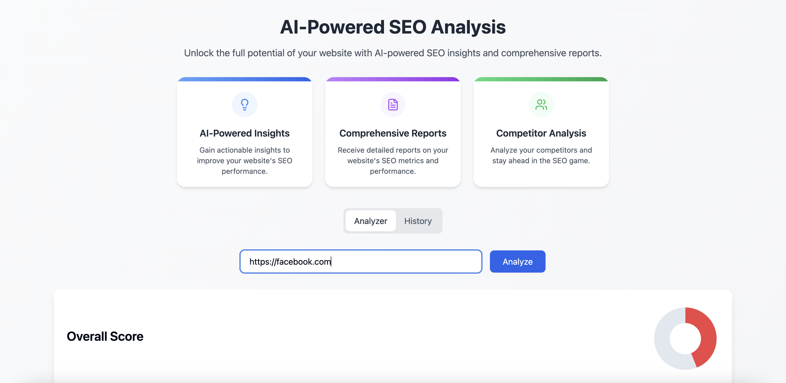

# AI-Powered SEO Analysis

Unlock the full potential of your website with AI-powered SEO insights and comprehensive reports.

## 📦 Installation

Follow these steps to set up the project locally.

### Prerequisites

- [Node.js](https://nodejs.org/) (version 16 or above)
- [React.js](https://react.dev/) (version 18 or above)

### Steps

1. **Clone the repository**
   - git clone https://github.com/SlickbitTechnologies/ai-engineering-hub.git
  
2. **Navigate into the project directory**
    - cd AI Summarize

3. **Install dependencies**
    - npm install

4. **Start the development server**
    - npm run dev

**The app should now be running on** http://localhost:3000

---

🧩 **Usage**

Setting Up Environment Variables:

Create a .env file in the root of your project and add below two lines, Replace your-api-key with your openAi secret key.

> PORT=3000

> VITE_GOOGLE_API_KEY=your-api-key

---

📞 Contact
- info@slickbit.com