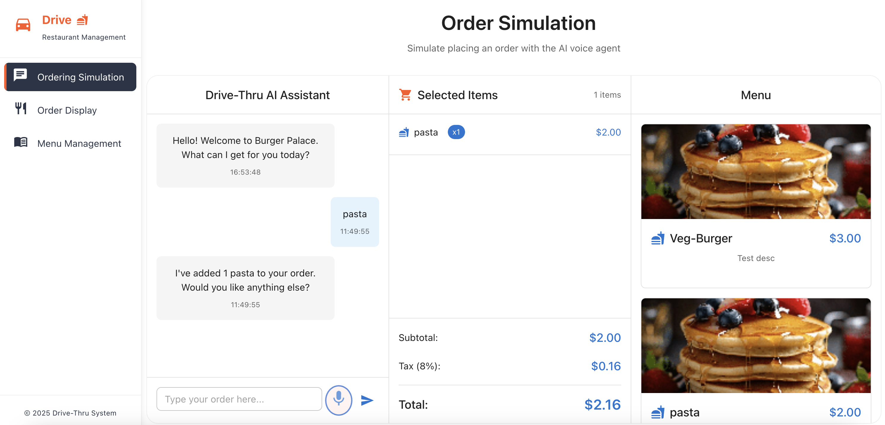

# 🚗 Drive-Thru AI Assistant
Simulate placing a food order using an AI-powered voice assistant.

## 📦 Installation

Follow these steps to set up the project locally.

### Prerequisites

- [Node.js](https://nodejs.org/) (version 16 or above)
- [React.js](https://react.dev/) (version 18 or above)

### Steps

1. **Clone the repository**
   - git clone https://github.com/SlickbitTechnologies/ai-engineering-hub.git
  
2. **Navigate into the project directory**
    - cd drive-thru-ai

3. **Install dependencies**
    - npm install

4. **Start the development server**
    - npm run dev

**The app should now be running at** http://localhost:3000

---

🧩 **Usage**

🔐 Setting Up Environment Variables: 

Create a .env file in the root of your project and add below line.

> PORT=3000

🎙️ Voice Command Support:
This project integrates the Vapi library to enable voice-based interaction.
However, voice functionality does not work on localhost due to CORS policy restrictions.

To enable voice features during local development, use ngrok to expose your local server.

🚀 Steps to Use ngrok
Sign up for ngrok and install your authtoken.

Start ngrok with this command:

 - ngrok http --url=localhost 3001

example: ngrok http --url=national-tough-ghost.ngrok-free.app 3001

Use the generated ngrok URL in your application instead of localhost.

---

📞 Contact
For any queries or support, feel free to reach out:

Email: info@slickbit.com