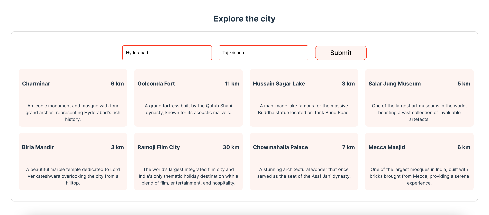

# Explore The City using AI

The Explore the City app helps users discover nearby sightseeing places from their current location or hotel. By entering the city name and hotel name and clicking "Submit," the AI generates a list of nearby locations along with their distances in kilometers.

## 📦 Installation

Follow these steps to set up the project locally.

### Prerequisites

- [Node.js](https://nodejs.org/) (version 16 or above)
- [React.js](https://react.dev/) (version 18 or above)

### Steps

1. **Clone the repository**
   - git clone https://github.com/SlickbitTechnologies/ai-engineering-hub.git
  
2. **Navigate into the project directory**
    - cd explore_the_city

3. **Install dependencies**
    - npm install

4. **Start the development server**
    - npm run dev

**The app should now be running on** http://localhost:8079

---

🧩 **Usage**

Setting Up Environment Variables:

Create a .env file in the root of your project and add below two lines, Replace your-api-key with your openAi secret key.

> PORT=8079

> OPENAI_KEY=your-api-key

---

📞 Contact
- info@slickbit.com
